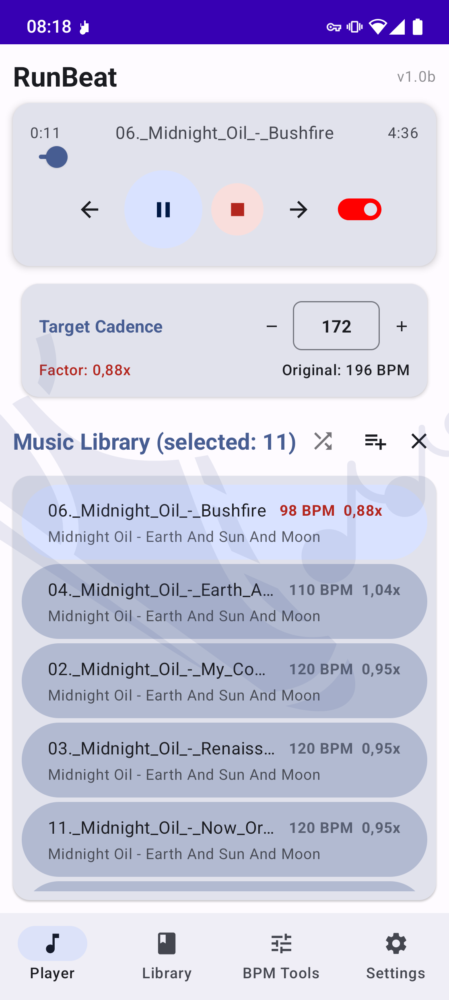
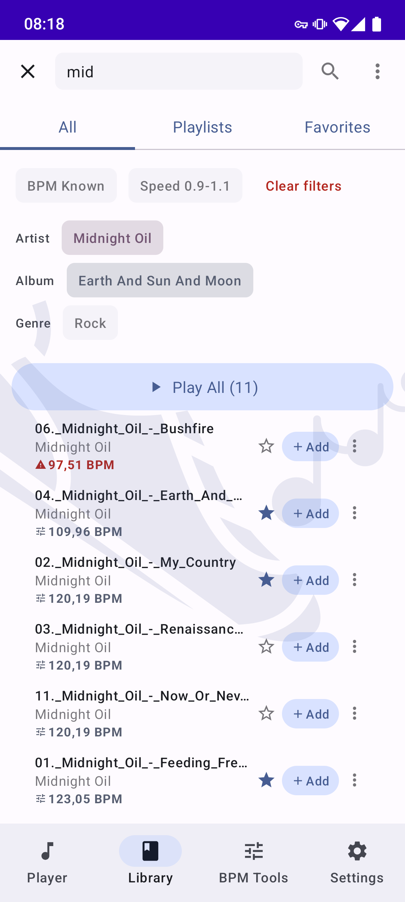
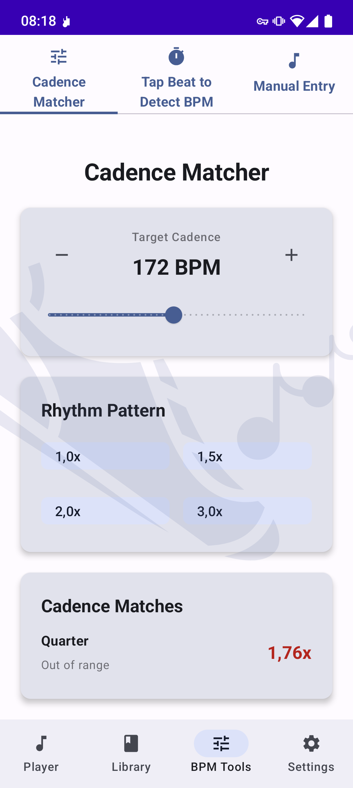
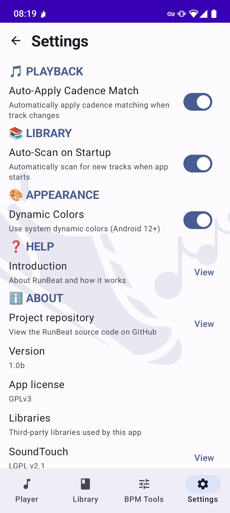

# RunBeat

<picture>
  <source media="(prefers-color-scheme: dark)" srcset="illustrations/logo-dark.svg">
  
</picture>

[](https://www.gnu.org/licenses/gpl-3.0)

**RunBeat — BPM-based Audio Player for Runners**

*Synchronize your running cadence with music tempo.* This Android app allows runners to adjust music playback speed (without changing pitch) to match their target step frequency, creating the perfect running rhythm.

## Features

- **Tempo Adjustment**: Change music speed without affecting pitch (using SoundTouch).
- **BPM Detection**: Automatic (via aubio) and manual (tap-to-beat) BPM detection.
- **Cadence Matching**: Automatically adjusts playback to match your running cadence (default: 172 BPM, range: 160-195 BPM). Choose **Binary** (1x / 2x) or **Ternary** (1.5x / 3x) beat subdivisions to keep your steps in time with the music.
- **Find Your Music**: Easy filtering of your tracks by Genre, Artist, Album, Name (leveraging Android Library metadata).
- **Playlist Support**: Playlists and CSV-based BPM import (Settings → Advanced).
- **Offline-First**: All data stored locally (Room database).
- **Background Playback**: Foreground service with notifications and Bluetooth controls.

## Screenshots

<p align="center">
  
  
  
  
</p>

## Installation

### Google Play Store

*Upcoming*

### F-Droid

*Upcoming*

### Build from Source

1. Clone the repo:

   ```bash
   git clone https://github.com/gpotdevin/runBeat.git
   cd runBeat
   ```

2. Set up an Android development environment (SDK, NDK 25.1.8937393, CMake).
3. Build:

   ```bash
   ./gradlew :app:assembleDebug
   ```

4. Install on a connected device:

   ```bash
   ./gradlew installDebug
   ```

See [BUILD.md](docs/BUILD.md) for detailed build instructions.

## Documentation

- [High-Level Architecture](docs/HIGH_LEVEL_ARCHITECTURE.md)
- [Algorithm Architecture](docs/ALGORITHM_ARCHITECTURE.md)
- [UI Architecture](docs/UI_ARCHITECTURE.md)
- [Build Instructions](docs/BUILD.md)

## Contributing

See [CONTRIBUTING.md](CONTRIBUTING.md) for contribution guidelines.

## License

This project is licensed under the **GNU General Public License v3.0 or later** — see the [LICENSE](LICENSE) file for details. Copyright (c) 2026 Guillaume Potdevin (see [COPYRIGHT](COPYRIGHT)).

## AI support

This app was made with support of *Mistral AI* models.


I personnally do not consider myself to be a good software developer. I was happy utilizing the models developed by Mistral AI to support me doing this work. I am not affiliated with the company, I simply purchased a regular subscription to use their services. I made my best to limit my token/energy consumption (nothing is as ugly to me as a token leaderboard).

### Third-Party Licenses

- **aubio**: GPLv3 (https://github.com/aubio/aubio)
- **soundtouch-android**: LGPLv2.1 + Apache 2.0 (https://github.com/hipxel/soundtouch-android)
- **ExoPlayer (Media3)**: Apache 2.0 (https://github.com/androidx/media)
- **Hilt**: Apache 2.0 (https://github.com/google/dagger)
- **Room**: Apache 2.0 (https://github.com/androidx/androidx)
- **Jetpack Compose**: Apache 2.0 (https://github.com/androidx/androidx)

See [NOTICES](NOTICES) for the full component list and license details.

## Support

- **Issues**: [GitHub Issues](https://github.com/gpotdevin/runBeat/issues)
